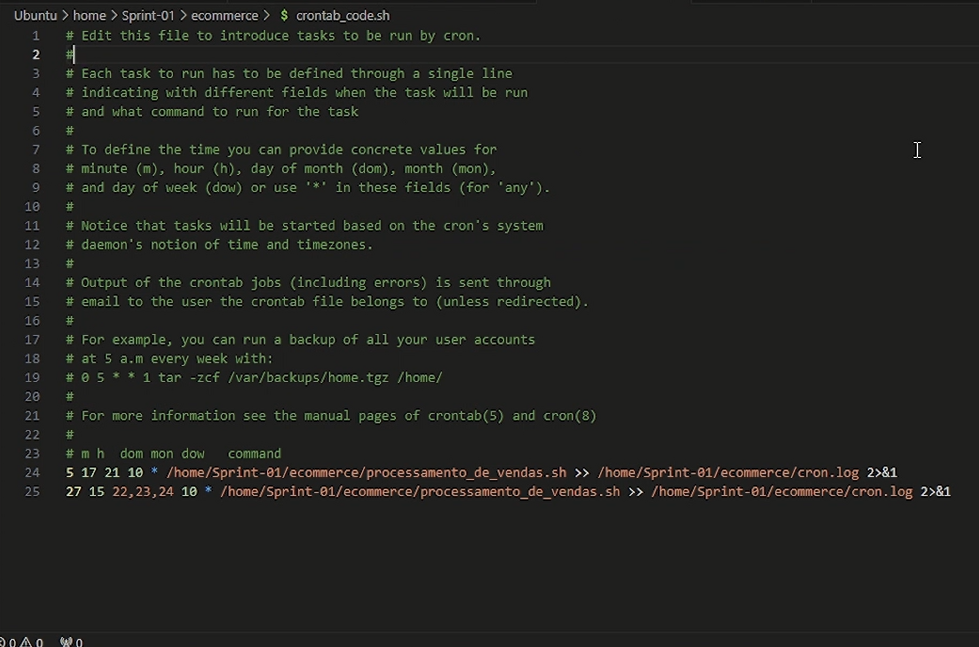
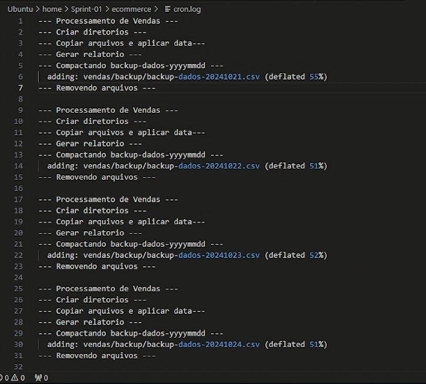

# Evidências
Esta imagem contém a comanda de agendamento na ferramenta crontab

Este é o .log gerado pelo cron da qual guarda os registros feito pelo script processamento_de_vendas.sh

Esta é a primeira execução do script processamento_de_vendas.sh

Esta é após as quatro execuções do processamento_de_vendas e da única execução do consolidador_processamento_de_vendas

