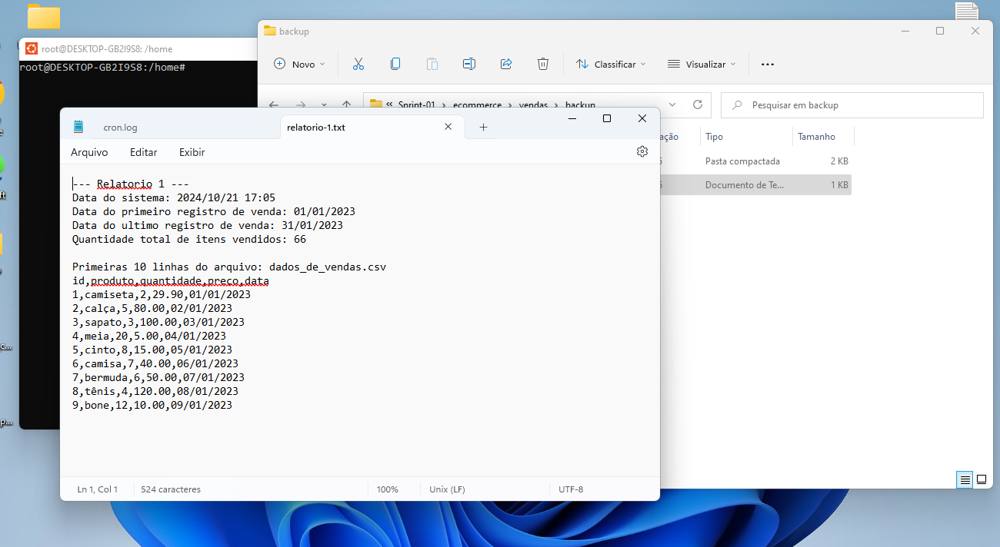
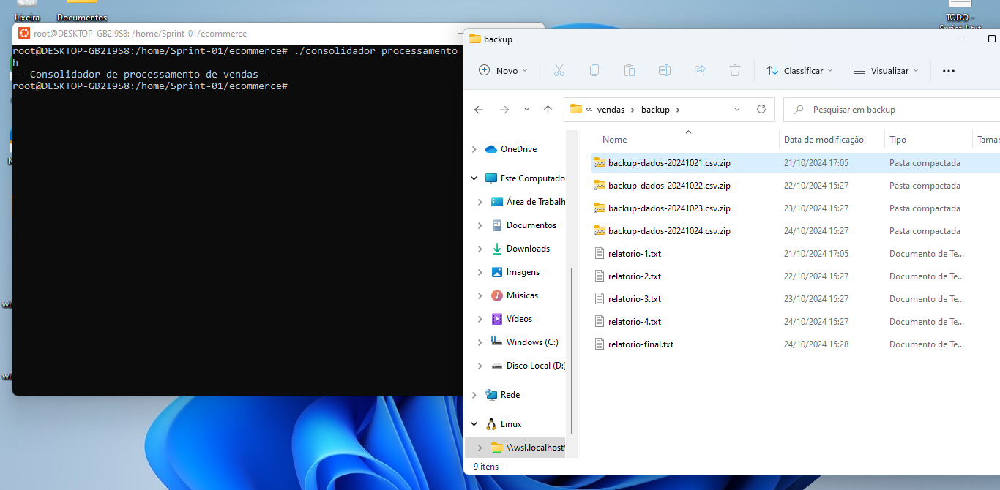

# Instruções
O desafio desta sprint é desenvolver dois scripts shells e utilizar o ambiente linux. Devemos manipular um arquivo chamado "dados_de_vendas.csv" e registrar uma série de informações deste arquivo em um relatório, bem como o script deve criar pastas, copiar, compactar e remover arquivos requisitados. O segundo shell script deverá juntar os quatro relatórios gerados pelo script anterior em um arquivo de texto único.
# Informações
Eu realizei o desafio utilizando puramente o shell script e não optei por usar o AWK. Criei a pasta ecommerce, dentro dela eu desenvolvi os dois shell scripts, bem como neste diretório se encontra o arquivo .csv que o script vai extrair as informações, então para cada dia eu movi um novo .csv dentro da pasta ecommerce para que o script consiga extrair dados diferentes a cada execução. Utilizei o cron para agendar as execuções.
# Anotações
A primeira execução ocorreu um pouco mais tarde da segunda-feira pois eu tive dificuldades em inicializar o agendamento a tempo, entretanto a execução dos dias seguidos ocorreu da forma esperada.
# Exercícios
Nesta sprint não houve exercícios.
# Evidências
Esta imagem é da primeira execução do script processamento_de_vendas.sh

Esta é a imagem após as quatro execuções do processamento_de_vendas.sh e da execução manual do consolidador_processamento_de_vendas.sh.

# Certificados

Esta sprint não houve cursos externos para realizar.