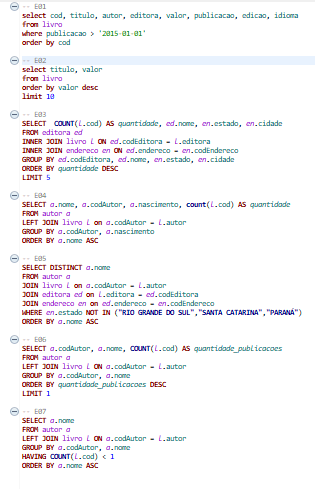

# Exercícios
## Dados livraria
São 7 exercícios propostos para consultar dados do arquivo livraria.

## Dados loja
São 9 exercícios utilizando o arquivo loja.

## Exportação de dados
Foi extraído dados do biblioteca.sqlite para csv. A primeira etapra é extrair os 10 livros mais caros da biblioteca, utilizando o separado ";" dentro do arquivo csv. A segunda etapa é extrair as 5 editoras com mais livros publicados e usar o separador "|" no csv.

## Código da etapa 1:

select livro.cod as CodLivro, livro.titulo as Titulo, autor.codautor as CodAutor, autor.nome as NomeAutor,
livro.valor as Valor, editora.codeditora as CodEditora, editora.nome as NomeEditora
from livro
left join autor on livro.cod = autor.codautor
left join editora on editora.codeditora = livro.cod 
group by NomeAutor
order by valor desc
limit 10

## Código da etapa 2:

select editora.codEditora AS CodEditora, editora.nome as NomeEditora, count(livro.editora) as QuantidadeLivro
from editora join livro ON editora.codEditora = livro.editora 
group by NomeEditora
order by NomeEditora
limit 5

## Arquivos
* Exercício_exportação_de_dados.sql
* Os_dez_livros_mais_caros.csv
* As_5_editoras_com_mais_livros_vendidos.csv