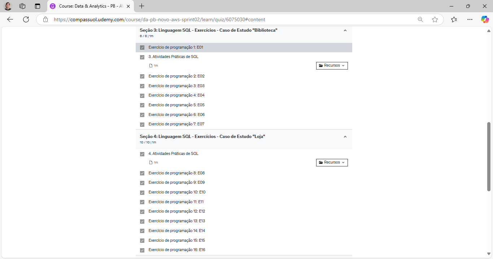
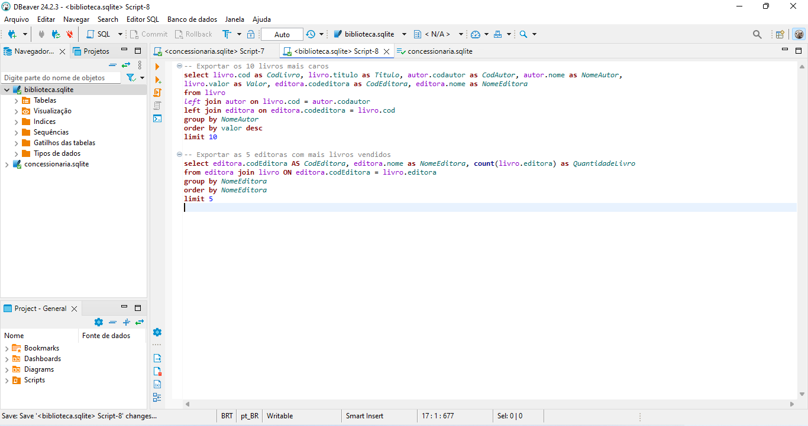

# Instruções
Nessa sprint estudamos a linguagem SQL e obtivemos a primeira experiência com um curso de AWS (Sales Acredditation). O desafio é aplicar conceitos de normalização e dimensionamento em um sql fornecido. Devemos extrair e separar o conteúdo do arquivo tb_locacao, este processo é a normalização, depois temos que transformar o modelo relacional obtido após a normalização para o modelo dimensional, da qual é útil para consultas. Nesta sprint foi proposto exercícios de SQL para resolver dividido em 2 etapas, a primeira é programar no sistema da udemy e a segunda é extrair dados em csv.
# Informações
Realizei os cursos e apliquei os conhecimentos nos exercícios, após eles eu realizei o desafio proposto, estou usando o Dbeaver para programar. Enquanto isso eu estudei o curso Sales Acredditation da AWS.
# Anotações
Esta foi a minha primeira expêriencia com a linguagem SQL e banco de dados, os exercícios propostos e o desafio conseguem entregar um bom aprendizado e fixação de conhecimento.
# Exercícios
Houve 7 exercícios utilizando o arquivo livraria e 9 exercícios utilizando o loja.sql, em seguida realizei o exercício de extração de dados, composto por 2 etapas, cada uma com instruções de quais dados extrair e como o arquivo csv deve ficar.
# Evidências
## Evidência dos exercícios SQL do arquivo biblioteca e loja

## Evidência dos exercícios de exportação de dados pra o formato csv

## Evidência do desafio, diagrama star squema

# Certificados
Sales Accreditation
* [AWS_Sales_Accreditation_Certificado](https://github.com/LuanAlcolea/PB-Luan-Alcolea/tree/main/Sprint-2/Certificados/sales_accreditation_certificado_luan_alcolea.pdf)