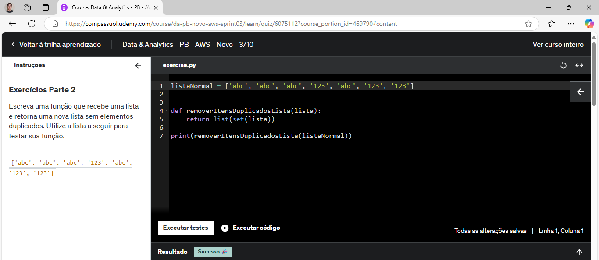
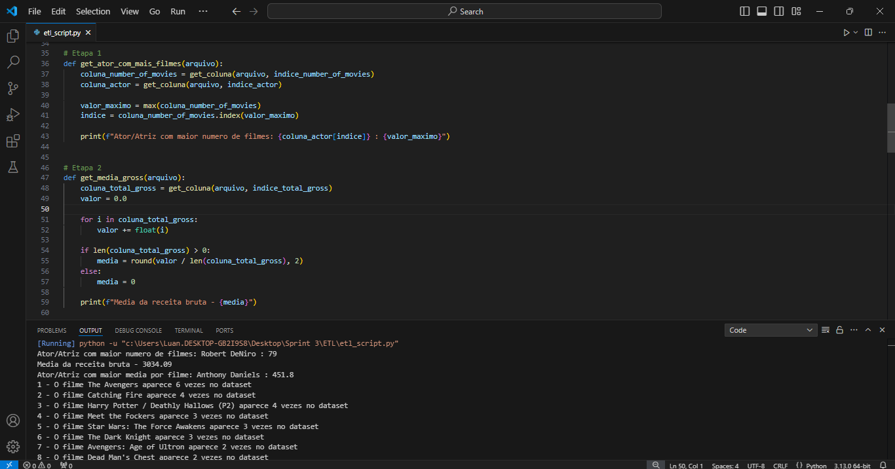
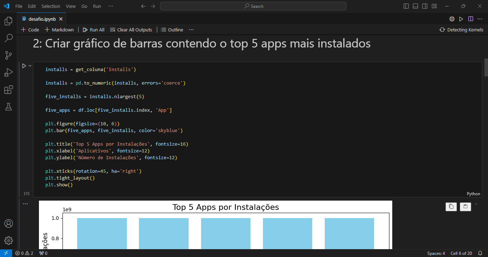

# Instruções
Nesta sprint estudamos a linguagem de programação Python do básico ao avançado e utilizamos as bibliotecas Pandas e Matplotlib, a primeira para extração e processamento de dados e a segunda para a geração de gráficos. Os exercícios propostos envolvem conceitos de paradigmas de programação em Python, como a orientada a objetos. Envolve também conceitos básicos do processo de ETL (Extract-Transform-Load).
# Informações
Realizei os scripts pelo VSCode e depois executei eles na plataforma da Udemy. Utilizei a extensão do Jupyter Notebook no VSCode para desenvolver o desafio.
# Anotações
Nesta sprint eu pude aproveitar muitos conhecimentos de processamento de dados e criação de gráficos, bem como os conceitos na prática da linguagem Python.
# Exercícios
Os exercícios propostos foi dividido em duas etapas. A primeira etapa consistem em 25 exercícios em Python que envolve a fixação de diversas operações na linguagem. A segunda etapa é o processo de extração e processamento de dados em Python, processo conhecido como ETL (Extract-Transform-Load).
# Desafio
O desafio consiste em criar scripts para extrair, processar e gerar gráficos de um dataframe fornecido. Devemos utilizar as bibliotecas Pandas e Matplotlib para desenvolver os scripts.
# Evidências
Evidências da execução dos exerícicos e desafio na Udemy:

# Certificados
Nesta sprint foi um curso AWS externo realizado:
Aspectos Econômicos na Nuvem
* [AWS_Aspectos_Economicos_na_Nuvem_Certificado](https://github.com/LuanAlcolea/PB-Luan-Alcolea/tree/main/Sprint-3/Certificados/AWS_Aspectos_economicos_da_nuvem_Luan_Alcolea.pdf)