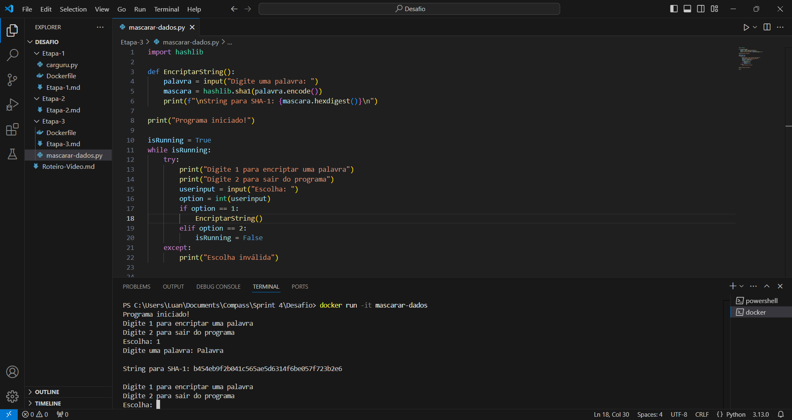

# Instruções
O objetivo desta sprint é estudar e aplicar os conhecimentos de criação de imagens e containers utilizando a ferramenta Docker. Aprendemos a criar uma imagem para instanciar um container que seja capaz de executar um script Python em qualquer sistema que tenha o Docker instalado. Durante a sprint, estudamos e resolvemos exercícios utilizando o paradigma funcional em Python.
# Informações
Todos os scripts foram realizados utilizando o VSCode, os exercícios foram previamentes testados da IDE e depois executados na Udemy. O desenvolvimento da imagem e afins também foram todos realizados na IDE.
# Anotações
Nesta sprint podemos exercítar os conceitos da linguagem Python, bem como esta foi a primeira sprint utilizando a ferramenta Docker.
# Exercícios
São 7 exercícios para resolver na plataforma Udemy. No desafio desenvolvemos o script de geração de hash SHA-1.
# Desafio
O desafio proposto tem como objetivo a aplicação dos conhecimentos de Docker e Python, devemos criar imagens e gerar containers bem como desenvolver um script Python e executá-lo no modo interativo.
# Evidências
### Evidências de execução dos exercícios e desafio
*Exercício 1:*

*Exercício 2:*

*Execução desafio (etapa 3):*

# Certificados
Nesta sprint houve cursos AWS externos:

* [AWS_Partner_Credenciamento_Tecnico](https://github.com/LuanAlcolea/PB-Luan-Alcolea/tree/main/Sprint-4/Certificados/AWS_Partner_Credenciamento_Tecnico_Luan_Alcolea.pdf)

* [AWS_Technical_Essentials](https://github.com/LuanAlcolea/PB-Luan-Alcolea/tree/main/Sprint-4/Certificados/AWS_Technical_Essentials_Luan_Alcolea.pdf)