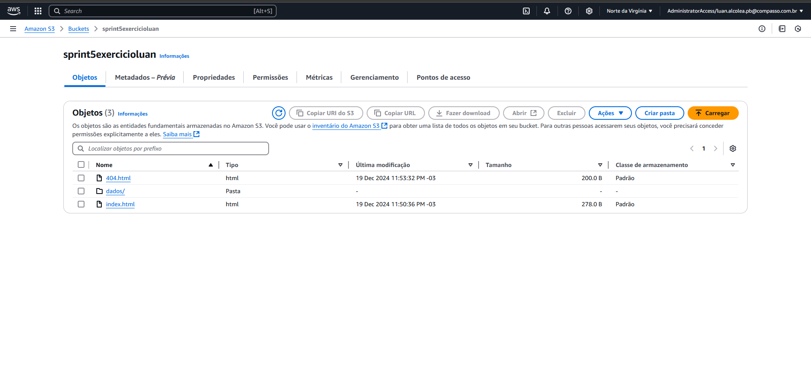
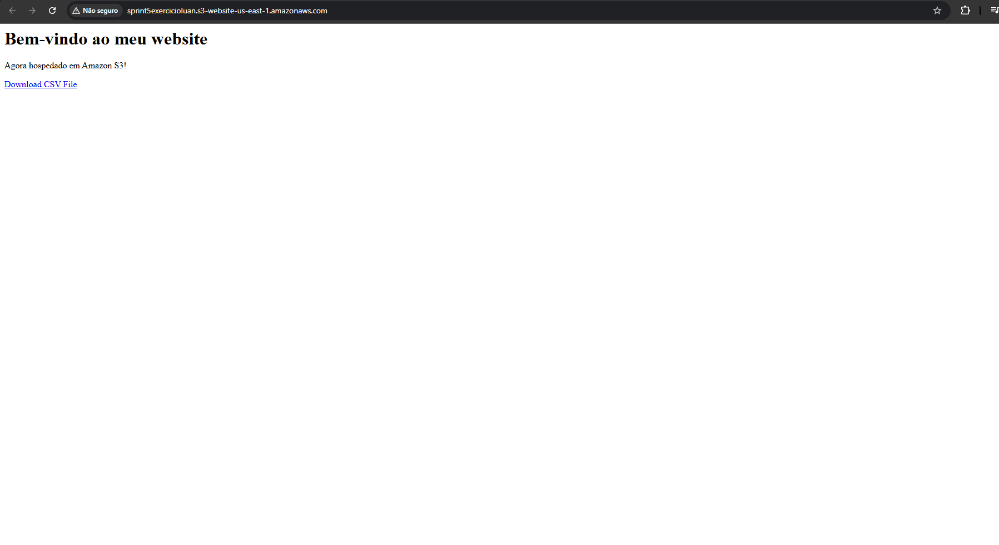
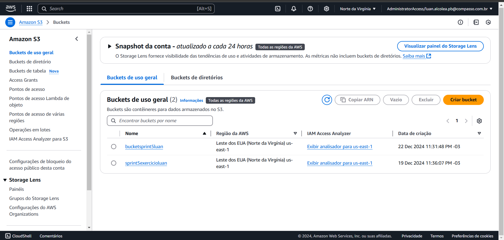
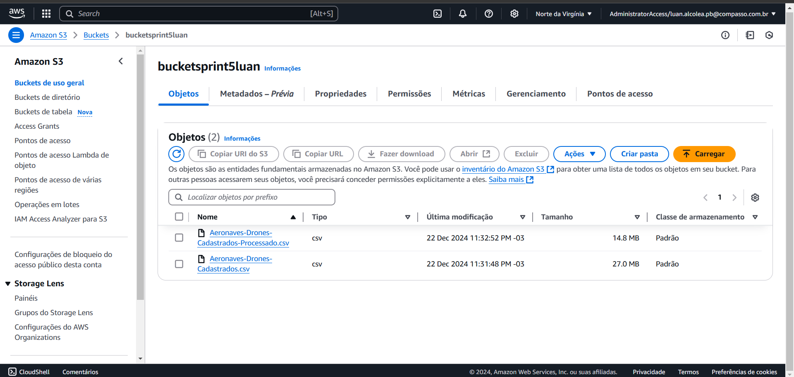

# Resumo da sprint
Esta sprint foi muito importante para o estudo de computação em nuvem na AWS. Estudamos na pratica os conceitos do AWS e o valor corporativo dos serviços que a Amazon oferece as empresas. Criamos buckets e operamos aos objetos no Amazon S3 e instanciamos servidores no Amazon EC2. Utilizamos uma base de dados baixados escolhidos por nós para a realização do desafio, que consiste em baixar e carregar objetos pelo bucket e processar a base de dados utilizando a linguagem Python.
# Informações
As ferramentas que eu utilizei nesta sprint foi a IDE VSCode e a biblioteca Polars para o processamento de dados. A base de dados eu baixei no site dados.gov.br conforme as instruções do desafio.
# Exercícios
Neste exercícios devemos carregar os arquivos index.html e error.html para um bucket, configura-lo corretamente para que um link publico seja gerado, possibilitando qualquer máquina pública acessa-la.

* [Abrir pasta exercícios](https://github.com/LuanAlcolea/PB-Luan-Alcolea/tree/main/Sprint-5/Exercícios/README.md)

# Desafio
O desafio tem como objetivo a pratica de utilização do Amazon S3. A primeira etapa é carregar a nossa base de dados para o bucket através de um script python, usando a biblioteca boto3. A segunda etapa é baixar esta base de dados e processa-la localmente, em seguida carregar o novo dataframe processado ao bucket.

* [Abrir pasta desafio](https://github.com/LuanAlcolea/PB-Luan-Alcolea/tree/main/Sprint-5/Desafio/README.md)

# Evidências
Evidências de execução do exercício e desafio.

* [Abrir pasta evidências](https://github.com/LuanAlcolea/PB-Luan-Alcolea/tree/main/Sprint-5/Evidências/README.md)

# Certificados

* [AWS_Cloud Quest: Cloud Practitioner](https://www.credly.com/badges/60a24df9-6d7b-4293-841d-9cfc9c046d02/public_url)

* [AWS_Curso-padrão de preparação para o exame: AWS Certified Cloud Practitioner](https://github.com/LuanAlcolea/PB-Luan-Alcolea/tree/main/Sprint-5/Certificados/AWS_Curso_padrão_de_preparacao_para_o_exame_AWS_Certified_Cloud_Practitioner_Luan_Alcolea.pdf)

* [Abrir pasta certificados](https://github.com/LuanAlcolea/PB-Luan-Alcolea/tree/main/Sprint-5/Certificados/)