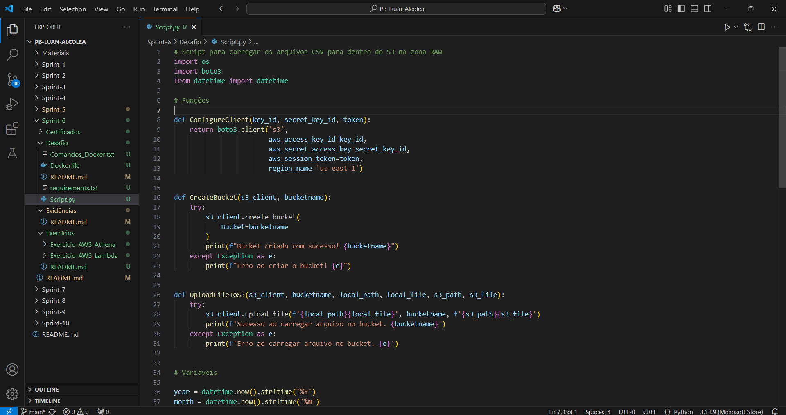
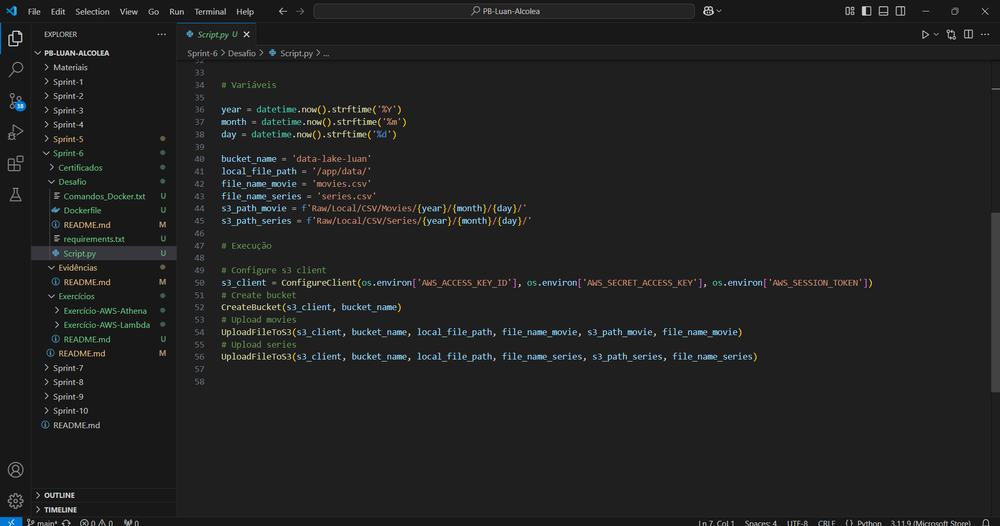
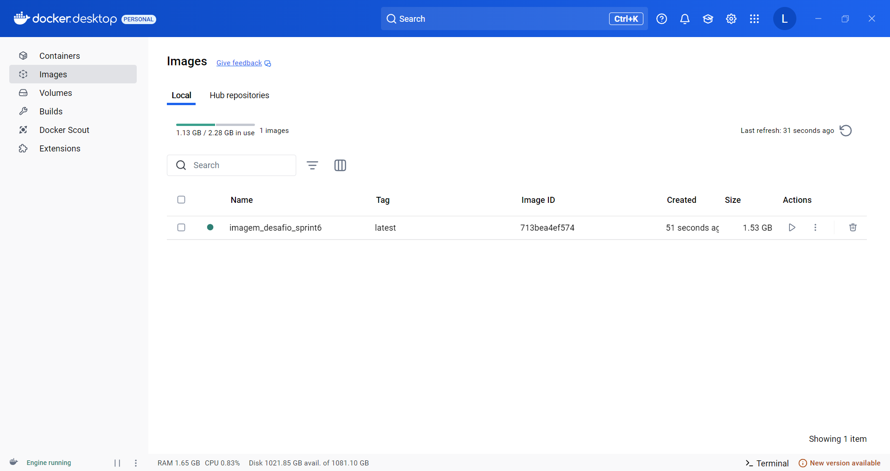
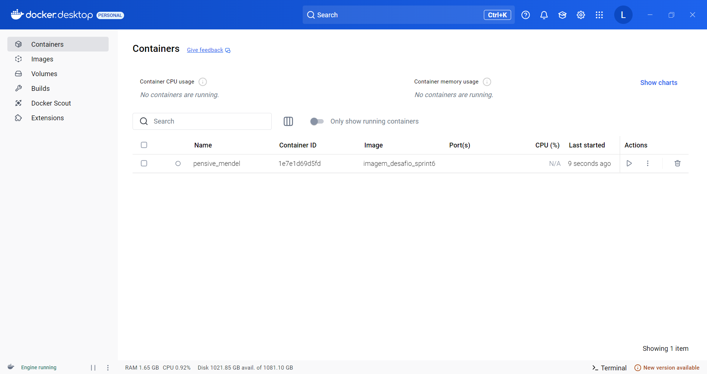
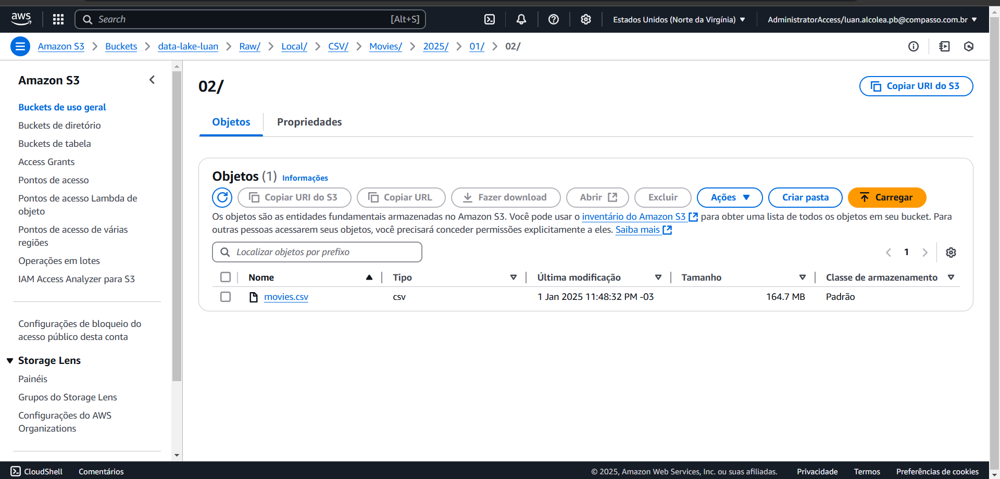
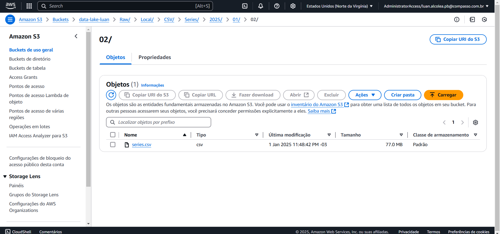

# Desafio Sprint 6
## Resumo
Neste desafio realizamos a primeira de cinco entregas do desafio final, esta entrega consiste em carregar os dois arquivos de dados para o S3. O script python deve ser executado dentro do container docker e os arquivos devem estar presente no container antes de ser carregado para o S3.
## Passo a passo
### Criação do script python
Primeiramente desenvolvi os script python para carregar os arquivos do container para o S3.


### Criação da imagem docker
Posteriormente criei a imagem e instanciei o container, no terminal é específicado a localização local dos arquivos de dados e a localização dos arquivos dentro do container.



Comandos no terminal executados:
```
docker build -t desafio_imagem_sprint6 .
docker run -v C:/Users/Luan/Desktop/Sprint-6/files:/app/data desafio_imagem_sprint6
```
### Resultado da execução do container
Logo após o instânciamento do container, os dois arquivos são carregados na zona RAW dentro do bucket.


## Entrega do desafio
Esta parte representa a primeira entrega do desafio final, acima está o passo a passo de como eu alcancei a resolução do desafio.