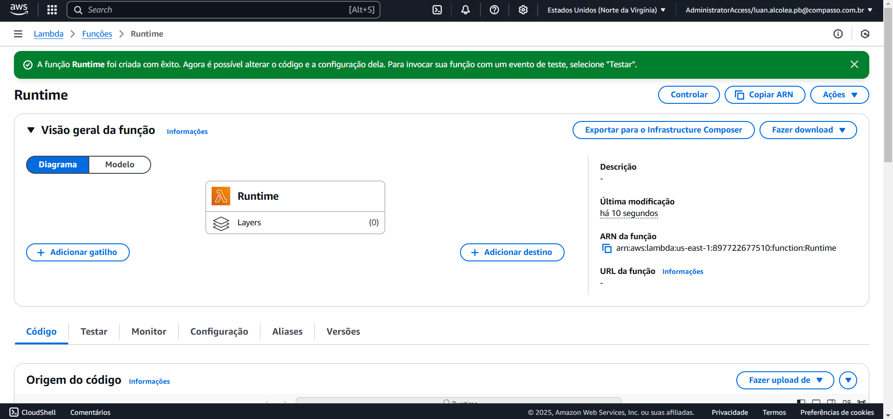
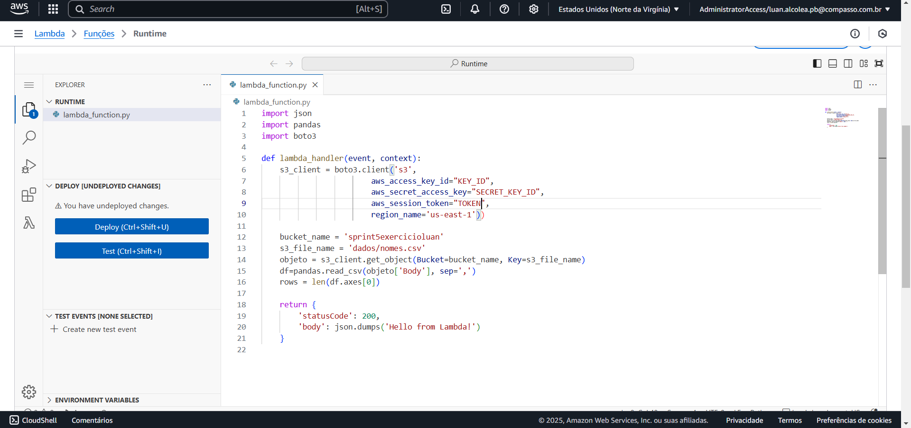
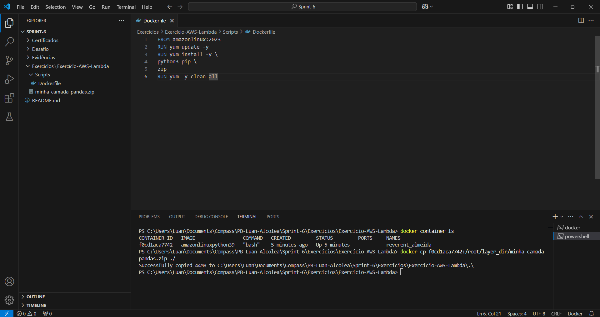
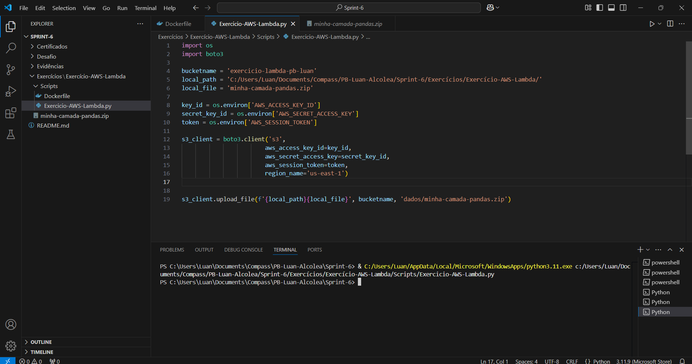
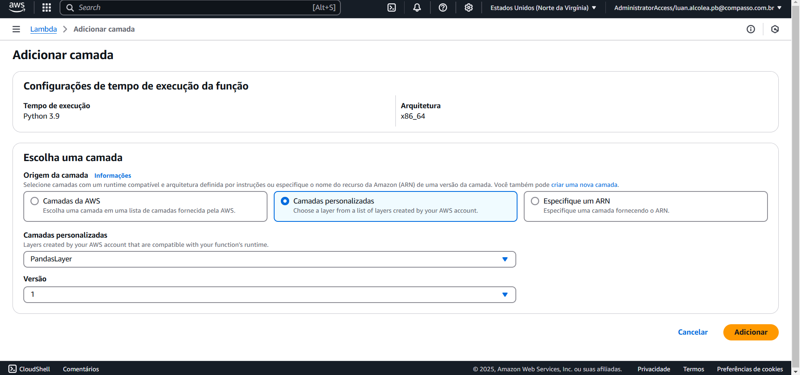

## Exercício Athena
### Preparar o bucket
Para iniciar o exercício devemos preparar o bucket. Criei um bucket chamado "exercicio-athena-luan" e baixei e carreguei o arquivo "nomes.csv" para dentro do bucket. Criei a pasta "queries" para guardar os resultados das analises dentro do Athena.


### Configuar o caminho para os resultados das queries
Configurei o caminho dos resultados das queries.


### Criando o banco de dados
Criei o banco de dados

### Criando as tabelas
Criei as tabelas conforme o arquivo "nomes.csv"

### Executando a querie final
Após executar a querie de teste, criei a querie requisitada e executei


### Código da querie
```sql
with nomes as (
  select
    nome,
    floor(ano / 10) * 10 as decada,
    count(*) as contagem,
    row_number() over (partition by floor(ano / 10) * 10 order by count(*) desc) as ranking
  from meubanco
  where ano >= 1950
  group by nome, floor(ano / 10) * 10
)
select nome, decada
from nomes
where ranking <= 3
order by decada, ranking;
```
## Exercício Lambda
Neste exercício devemos criar uma função lambda que vai executar uma operação usando a biblitoteca pandas, devemos configurar um layer para que a função lambda consiga utilizar a biblioteca.
### Criando a função lambda

### Construindo o código

### Criando Layer
Preparando imagem docker

Código .py para carregar os arquivos no S3

Configurando a camada no AWS Lambda

Execução final do exercício Lambda
