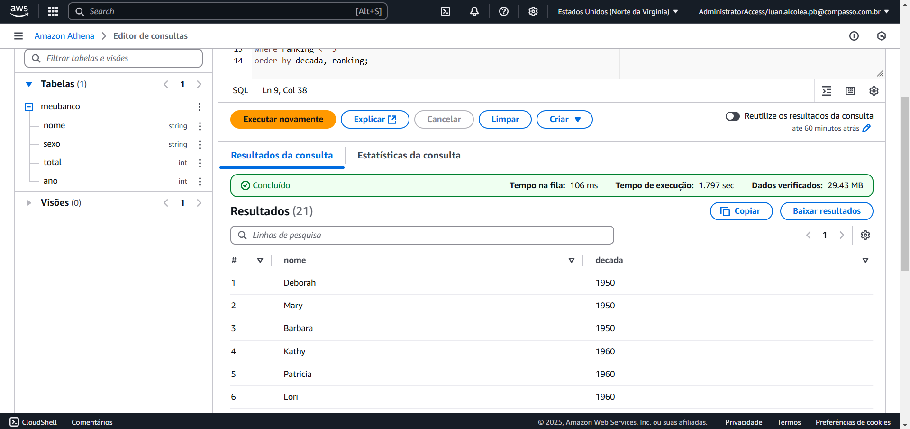
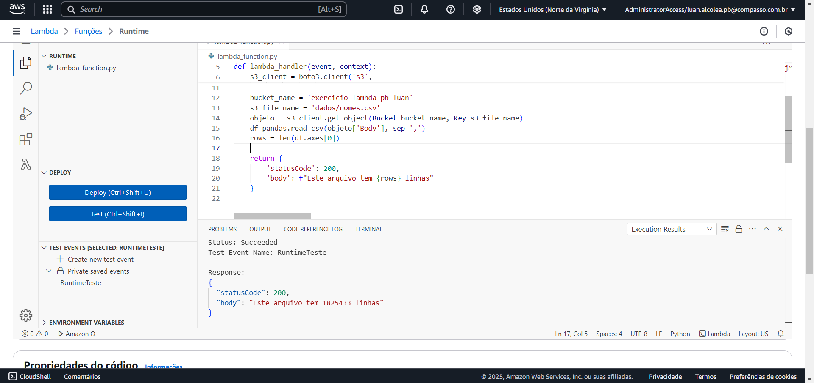
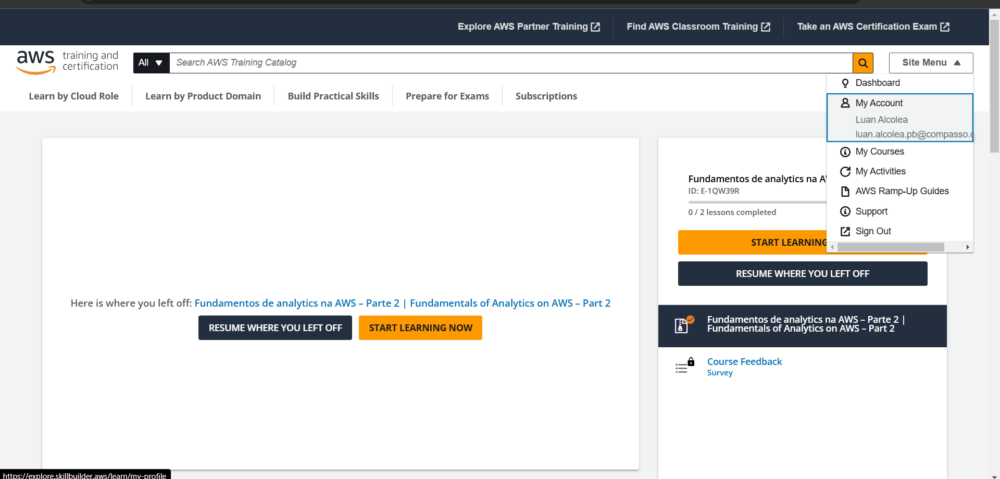
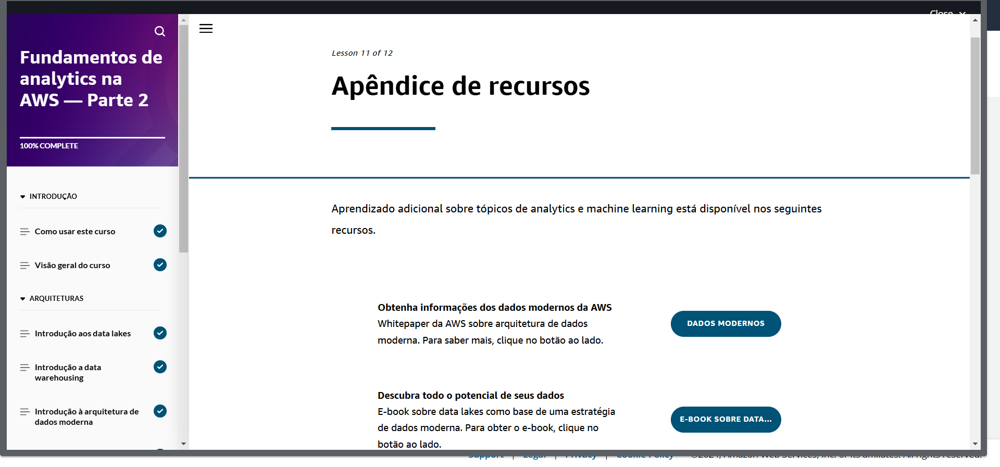

# Sprint 6
## Resumo
Esta Sprint apresenta um marco importante para o aprendizado da computação em nuvem da AWS e do programa de bolsas, pois é nesta entrega que iniciamos o desafio final. O desafio final consiste em construir um Data lake na nuvem passo a passo, envolvendo cada etapa do processo: armazenamento, processamento e consumo. Nesta entrega realizaremos o carregamento dos dois arquivos de dados disponibilizados para a zona RAW do nosso bucket S3, utilizaremos o python e o boto3 para enviar o arquivo, e o docker para containerização. Nesta etapa também nós exploramos os arquivos de dados e preparamos as perguntas que serão utilizadas nas entregas posteriores.

* [Abrir Evidências de execução da sprint](https://github.com/LuanAlcolea/PB-Luan-Alcolea/tree/main/Sprint-6/Desafio)

### Perguntas preparadas para as próximas etapas do desafio
 * Quais as recorrencias de profissões incomuns de atores/atrizes;
 * Quais são as linguagens mais incomuns dos filmes que obtiveram notas acima da média;
 * Quais países mais produziram filmes em cada decada entre 1960 a 2010;
 * Quais filmes que tem notas altas da qual foram as unicas atuações de atores/atrizes;
 * Quais são os filmes com notas acima da média com as maiores durações;

## Exercícios
### AWS Athena
O AWS Athena é um serviço de consultas de banco de dados armazenados dentro do S3 e não necessita de servidor para realizar as consultas. Neste exercício carregamos um arquivo de dados chamado "nomes.csv" para um bucket criado previamente, no mesmo bucket criamos a pasta "queries" para guardas os resultados das consultas. Então no AWS athena configuramos o serviço para acessar o nosso bucket e realizamos as consultas.

* Evidência de execução do exercício AWS Athena:

* [Abrir exercício AWS Athena](https://github.com/LuanAlcolea/PB-Luan-Alcolea/tree/main/Sprint-6/Exercícios/Exercício-AWS-Athena/)

### AWS Lambda
O AWS Lambda é um serviço de execução de código sem servidor, nele conseguimos escrever códigos e importar bibliotecas, bem como interegir com o S3 e afins. Para utilizar bibliotecas no Lambda devemos configurar um Layer, que se trata de um arquivo que contém uma biblioteca específica compactada que pode ser carregada para o Lambda.

* Evidência de execução do exercício AWS Lambda:

* [Abrir exercício AWS Lambda](https://github.com/LuanAlcolea/PB-Luan-Alcolea/tree/main/Sprint-6/Exercícios/Exercício-AWS-Lambda/)

## Desafio
Este desafio consiste na primeira de cinco entregas do desafio final, nesta entrega devemos configurar o nosso data lake, para isso devemos criar um bucket no S3 e carregar os arquivos bases sem modificações na zona RAW do bucket utilizando python e docker.

* [Abrir Desafio](https://github.com/LuanAlcolea/PB-Luan-Alcolea/tree/main/Sprint-6/Desafio)
## Cursos
Os cursos desta sprint abordaram na prática serviços da AWS como o Athena, Glue, Lambda, EMR, Redshift e datawarehouse. Ao todo foram 9 cursos realizados que proporcionam uma visão maior sobre o que estamos e o que iremos desenvolver no desafio final.
## Certificados
* [Noções básicas de Analytics na AWS Parte 1](Certificados/Noções-básicas-de-Analytics-na-AWS-Parte-1-Luan-Alcolea.pdf)

Não estou conseguindo obter meu certificado de conclusão deste curso da AWS, a baixo está prints da tela comprovando a sua conclusão.
* Certificado não emitido pela AWS! Noções básicas de Analytics na AWS Parte 2

* [Serveless Analytics](Certificados/Serverless-Analytics-Luan-Alcolea.pdf)

* [Introduction to Amazon Athena](Certificados/Introduction-to-Amazon-Athena-Luan-Alcolea.pdf)

* [AWS Glue Getting Started](Certificados/AWS-Glue-Getting-Started-Luan-Alcolea.pdf)

* [AWS EMR Getting Started](Certificados/Amazon-EMR-Getting-Started-Luan-Alcolea.pdf)

* [Getting Started with Amazon Redshift](Certificados/Getting-Started-with-Amazon-Redshift-Luan-Alcolea.pdf)

* [Best Practices for Data Warehousing with Amazon Redshift](Certificados/Best-Practices-for-Data-Warehousing-with-Amazon-Redshift-Luan-Alcolea.pdf)

* [Amazon QuickSight - Getting Started](Certificados/Amazon-QuickSight-GettingStarted-Luan-Alcolea.pdf)
