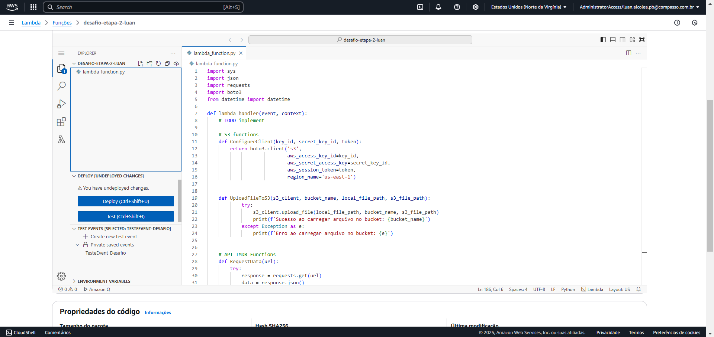

# Desafio da Sprint 7
## Resumo
O desafio desta sprint consiste em buscar dados da API TMDB para enriquecer o nosso banco de dados da qual esta armazenado no AWS S3, os dados devem ser armazenados no formato JSON e deve conter registros que complementam os registros dos arquivos "movies.csv" e "series.csv". O script deve ser executado dentro do AWS Lambda e deve guardar o resultado na camada RAW do nosso bucket do desafio final, o script deve gerar arquivos JSON com no máximo 100 registros de dados, se ultrapassar este número o script deve criar outro JSON. Esta entrega representa a segunda etapa do desafio final.

* [Acessar script do desafio](https://github.com/LuanAlcolea/PB-Luan-Alcolea/tree/main/Sprint-7/Desafio/Script_desafio.py)

## Passo a passo
### Perguntas preparadas para a extração de dados
O primeiro passo que fiz para a execução do desafio foi refinar as minhas perguntas que serão usadas nas sprints posteriores, as minhas perguntas buscam gerar insights relevantes sobre os resultados de filmes das quais fizeram escolhas interessantes de atores/atrizes, bem como quais produtores conseguem gerenciar filmes de sucesso. As perguntas que eu preparei foram:
* Quais atores participaram de filmes de sucesso;
* Quais atores estrearam suas participações e quais foram as produções de sucessos imediatos;
* Quais foram as produções de sucesso com mais diversidades de atores
* Quais atores evoluiram consideiravelmente a cada produção;
* Quais as combinações de atores que fizeram sucesso;
* Quais as combinações de produtores que fizeram sucesso;
### Os dados extraídos da API TMDB
Estes são os dados que extraí da API TMDB para responder as minhas perguntas:

* Movie ID
* Movie name
* Release date
* Rating
* Budget
* Revenue
* Actors
* Crew

Com esses dados eu consigo adicionar mais informações dos atores/atrizes, produtores e do investimento e retorno dos filmes do arquivo "movies.csv"
### Desenvolvimento do script
Após as perguntas e os dados necessários foram definidos, criei o script que vai buscar os dados da API TMDB, o script foi inicialmente desenvolvido no vscode e posteriormente adaptado ao AWS Lambda.

Para executar o script no Lambda eu criei um Layer chamado "RequestsLayer" da qual vai permitir que o script use a biblioteca "Requests" no código, necesária para a extração de dados da API.

Após tudo configurado, hora de executar o script

### Entrega do desafio
Após a execução do script, um novo arquivo JSON foi criado na camada RAW do meu bucket, este arquivo será utilizado em sprints posteriores e está nesta localização para a organização de todo o processo. Esta é a segunda entrega do desafio final.

* Resultado da execução: arquivo gerado no AWS S3

* Resultado da execução: estrutura dos dados no JSON

