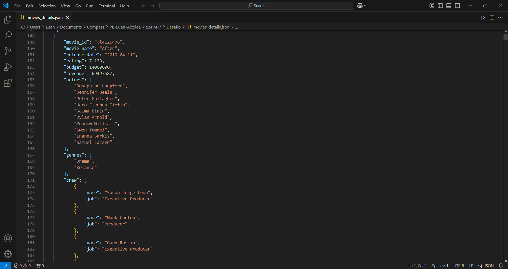

## Evidências de execução
Este arquivo contém imagens de evidências da execução do desafio e exercícios, as imagens são capturas de telas que representam o passo a passo e resultado de cada exercício e do desafio da sprint.
## Evidências de execução do desafio
* Evidência da criação do layer da biblioteca "requests"

* Evidência da execução do script lambda

* Evidência da criação do arquivo JSON

* Evidência do arquivo JSON criado

## Evidências de execução dos exercícios
### Evidências de execução do exercício de spark

### Evidências de execução do exercício da API TMDB

### Evidências de execução do exercício do AWS GLUE

