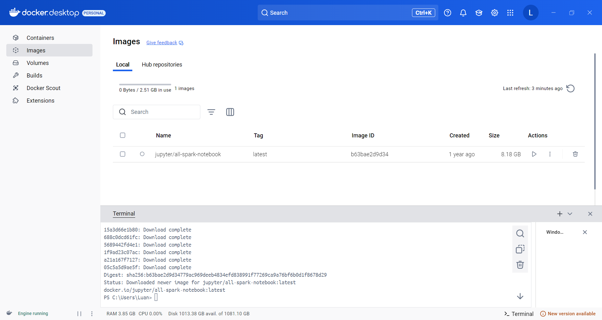
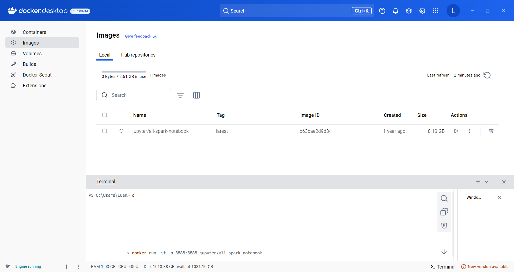
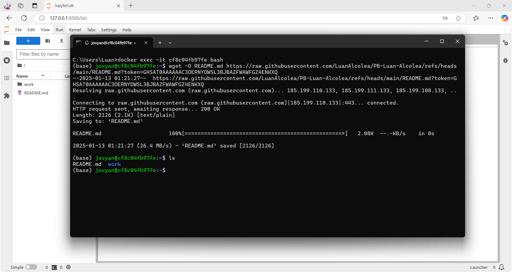
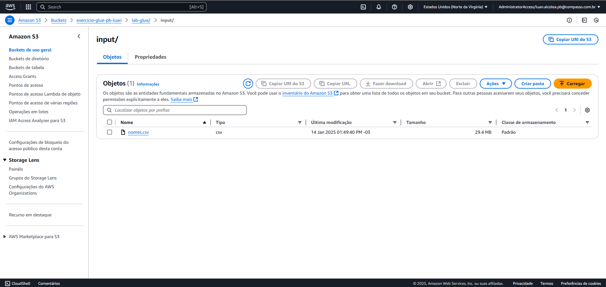
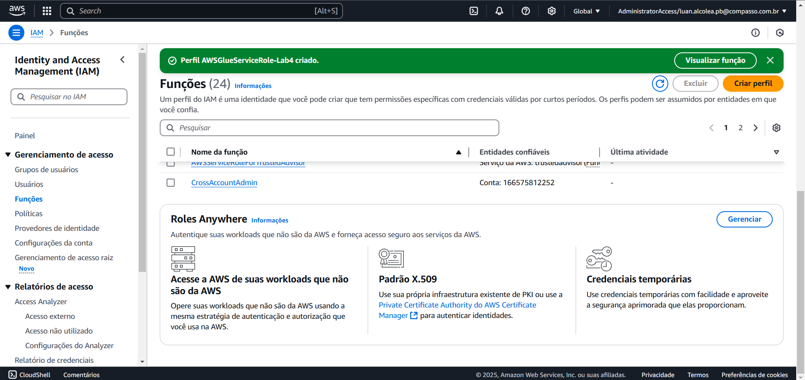
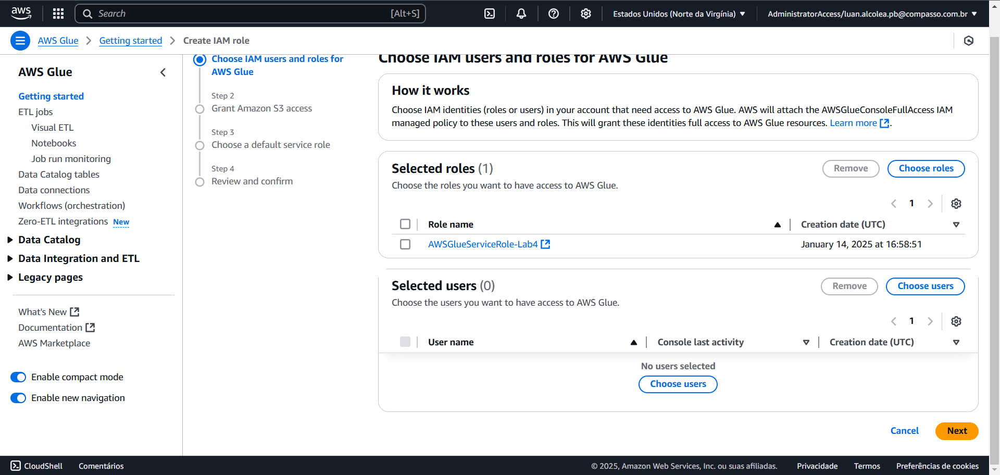
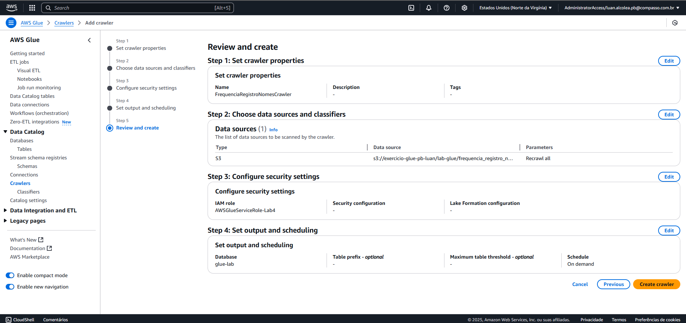

# Exercícios
Este README contém as evidências de execução dos exercícios propostos na sprint.
## Exercício Apache-Spark: Contador de palavras
Devemos usar o pyspark para contar a quantidade de palavras contidas em nosso README de apresentação do repositório do PB, para isso vamos usar uma imagem docker já existente chamada "jupyter/all-spark-notebook" da qual contém o pyspark já instalado. Vamos criar o container da imagem e dentro dele baixar o README.md e realizar os comandos necessários para contar as palavras contida no arquivo. A baixo segue o passo a passo da realização do exercício Apache-Spark.

Primeiro passo é baixar a imagem que vamos utilizar, optei por usar o terminal do docker para realizar este passo:
* Baixando a imagem necessária:

Agora vamos criar o container a partir desta imagem:
* Criando container da imagem:

Após o container ser executado no modo interativo e o url de acesso for extraído, devemos conectar o nosso cmd com o a maquina do container:
* Extraíndo URL para abrir a máquina no navegador:

Realizar o download do README.md do repositório
* Com o CMD já conectado a máquina, realizo o download do README.md

Agora devemos iniciar o pyspark no CMD
* Iniciando o pyspark:

Neste momento podemos execuar os comandos para iniciar a contagem de palavras do repositório

* Realizando a contagem de palavras

## Exercício API_TMDB
Neste exercício devemos copiar um script python da qual vai realizar os requests necessários para extrair dados do TMDB usando a biblioteca Requests e gerar um dataframe com a biblioteca Pandas.
* Com o script já copiado na IDE, iniciei a execução

## Exercício AWS Glue
Neste exercício vamos realizar a etapa simplificada de ETL usando o serviço AWS Glue, para isso devemos seguir o passo a passo disponibilizado em um arquivo PDF.

Criei um novo bucket, criei as respectivas pastas e realizei o upload do arquivo "nomes.csv" para dentro da pasta "input"

* Bucket, diretorios e arquivo

Devemos configuar o IAM Role para dar acesso do Glue ao S3

* Configurando IAM Role

Agora vamos configurar a nossa conta para usar o Glue

* Criando o perfil Glue

* Adicionando permissões ao perfil

Agora vamos criar um Job no AWS Glue, para isso devemos seguir uma série de configurações para definir corretamente como o script vai executar, incluindo o caminho de "input" e o caminho de "target" no AWS S3.

* Configurando o Job

* Script escrito dentro do Job do Glue

Após a execução do script devemos remover as execuções de Jobs, vamos certificar de que não há execução indesejada no Glue.
Agora vamos criar um script de processamento de dados, vamos imprimir uma série de valores e aplicar mudanças no arquivo "nomes.csv" inteiro, o resultado deve ser salvo na pasta "target" do S3.

* Escrevi as transformações e impressões necessárias

Depois vamos configurar o Crawler, para isso vamos na parte de Crawlers no AWS Glue

* Configurando o Crawler

Depois vamos executar o script que o crawler gerou no AWS Athena, este é o resultado

* Resultado da execução do crawler

