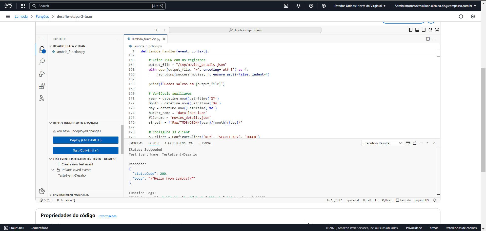
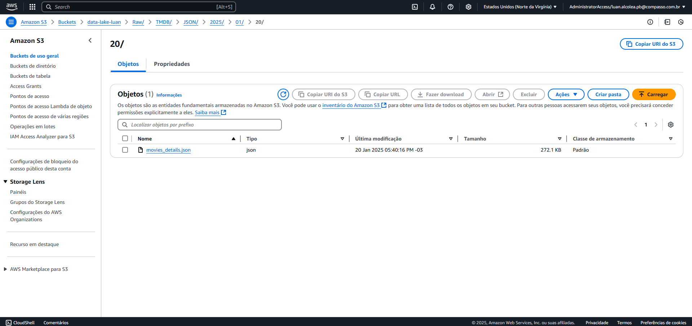
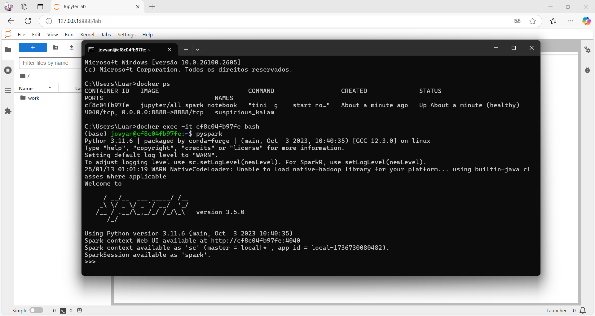
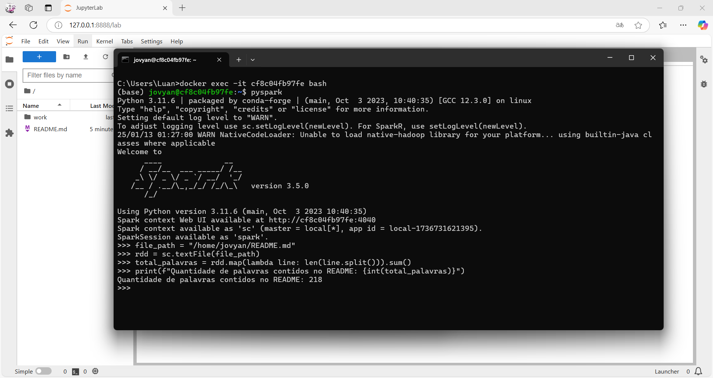
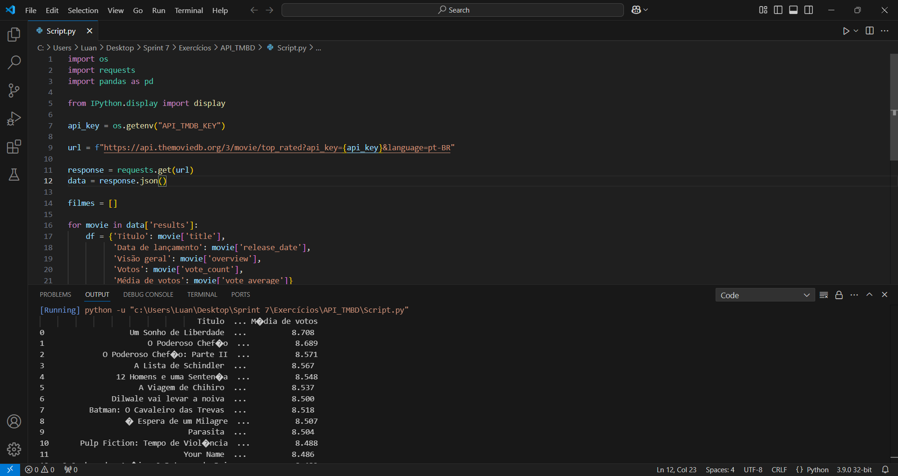
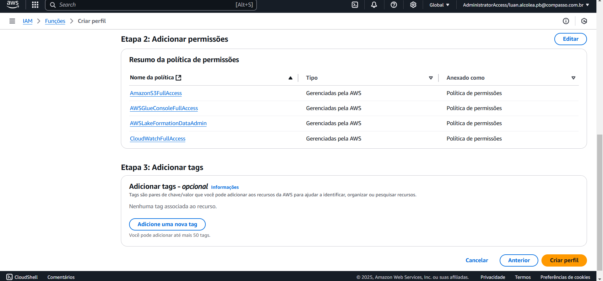
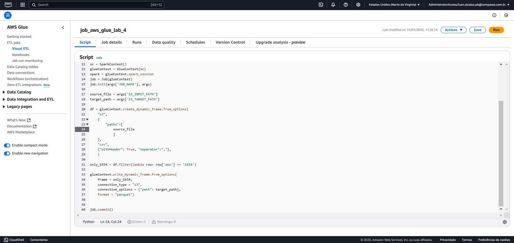
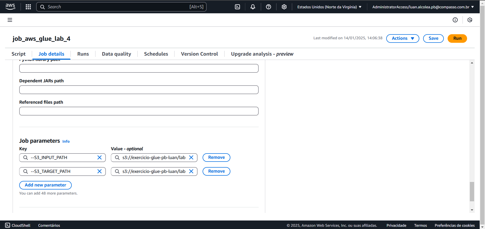
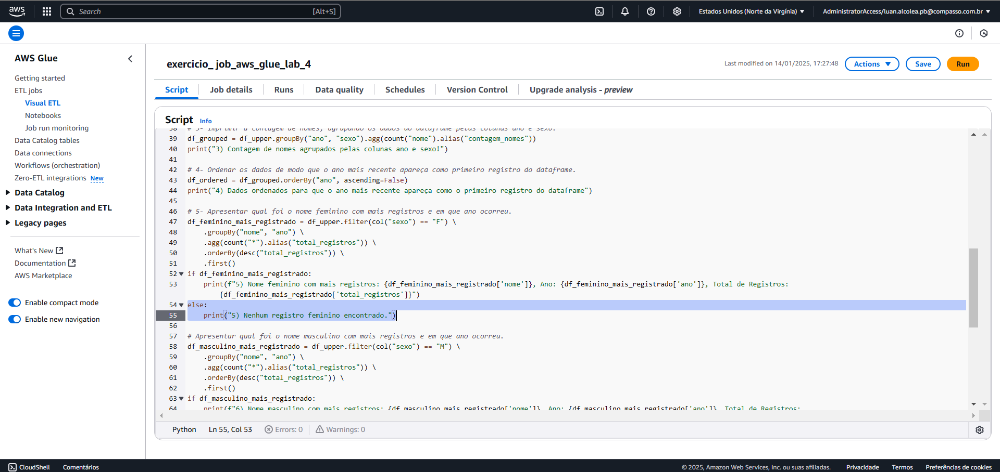
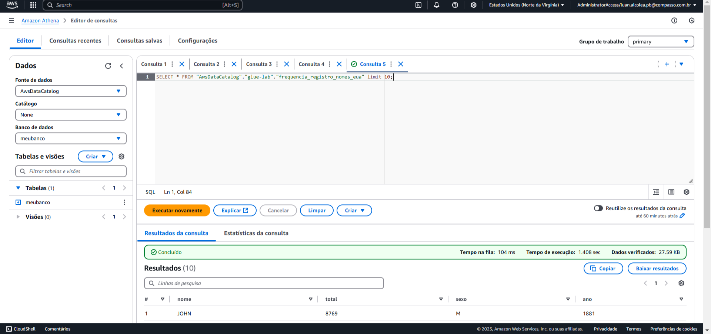

# Sprint 7
## Resumo
Nesta sprint representa a segunda entrega do desafio final, nesta etapa consiste em extrair dados da API TMDB ou da API IMDB para enriquecer a quantidade de dados dispostos para ser utilizado nas próximos etapas do desafio. Também realizamos os exercícios propostos da qual utilizam os serviços da AWS, utilizaremos o pyspark juntamente com o docker para a realização do exercício de pyspark, também foi nesta sprint que tivemos contato com a API TMDB da qual usamos para extrair os dados necessários.

Para realizar as extrações de dados na API TMDB eu reformulei as minhas perguntas para que possam gerar insights melhores e que eu possa extraír dados relevantes da API. Primeiramente eu criei o script dentro do VSCode para depois adapta-lo ao AWS Lambda.

## Exercícios
Nesta sprint realizamos 3 exercícios diferentes para a fixação de conteúdo sobre os conceitos de pyspark, API TMDB para buscar dados para o desafio e do AWS Glue para ETLs em nuvem.

* [Acessar exercícios](https://github.com/LuanAlcolea/PB-Luan-Alcolea/tree/main/Sprint-7/Exercícios/README.md)

## Desafio
Neste desafio fizemos a extração de dados da API TMDB para dentro de nosso Bucket na camada RAW do AWS S3. Esta etapa representa a segunda entrega do desafio final da qual vamos aumentar a quantidade de dados dispostos a nós para responder as questões criadas por nós mesmos.

* [Acessar desafio](https://github.com/LuanAlcolea/PB-Luan-Alcolea/tree/main/Sprint-7/Desafio/README.md)

# Evidências de execução
Neste tópico contém as evidências de execução dos exercícios e desafio da sprint 7.

* [Acessar evidências](https://github.com/LuanAlcolea/PB-Luan-Alcolea/tree/main/Sprint-7/Evidências/README.md)

### Evidências de execução do desafio
* Script dentro do lambda

* Imagem do arquivo gerado pelo script

### Evidências de execução do exercício Spark
* Iniciando o pyspark dentro do container criado a partir da imagem "jupyter/all-spark-notebook"

* Inserindo os comandos necessários para contar as palavras do arquivo README.md baixado

### Evidências de execução do exercício API TMDB
* Script de exemplo para extraír dados da API TMDB e imprimir usando o Pandas

### Evidências de execução do exercício AWS GLUE
* Configurando IAM Roles para utilizar o AWS GLUE

* Escrevendo script de exemplo para executar no GLUE

* Configurando o job do exercício

* Imagem do script criado para o exercício

* O resultado da configuração do crawler já depois da execução do script

## Cursos
Não houve cursos externos realizados nesta sprint.