# Evidências de execução
Este README contém as capturas de telas que comprovam as execuções dos exercícios e do desafio proposto.

## Exercícios
### Geração em massa de dados

* Resultado da execução do script do exercício de geração de dados
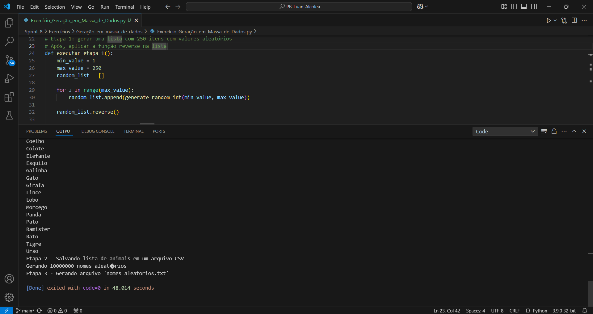
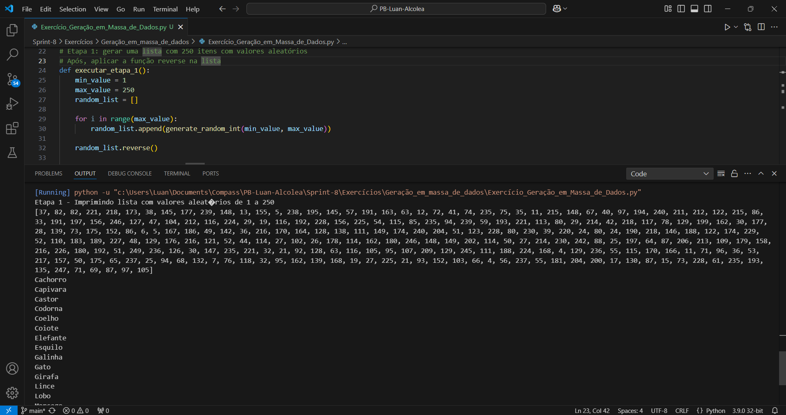

### Apache Spark
* Resultado da execução do script do apache spark
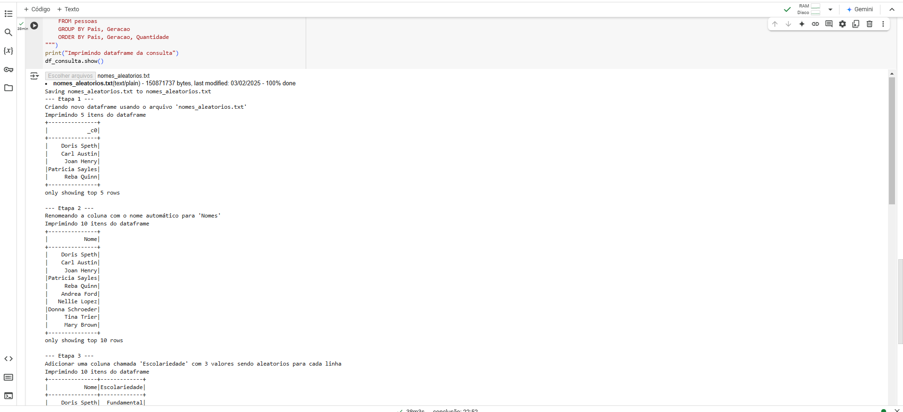
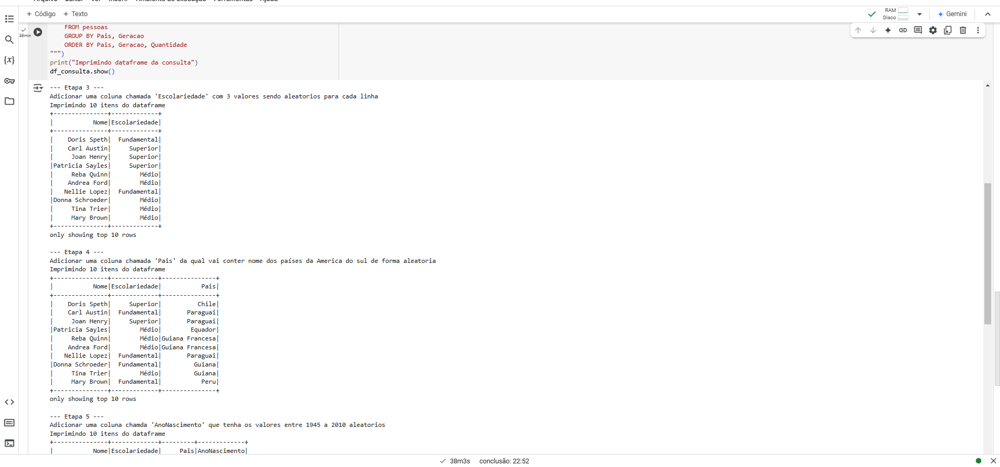

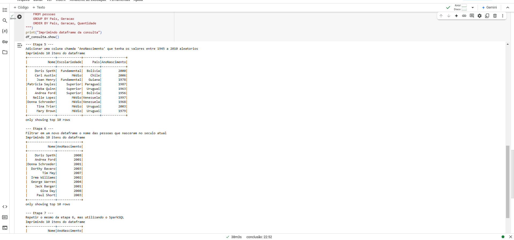
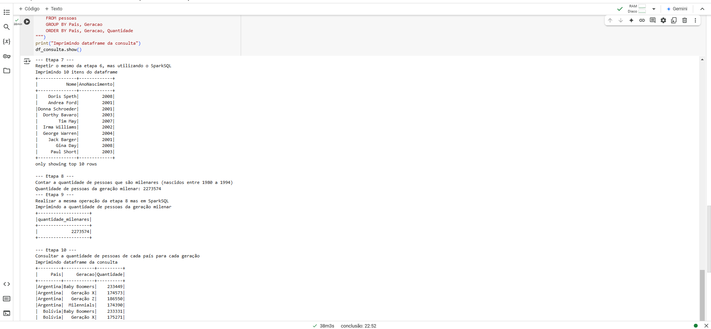

## Desafio
### Log de execução
* Log de execução do desafio do script de conversão json para parquet
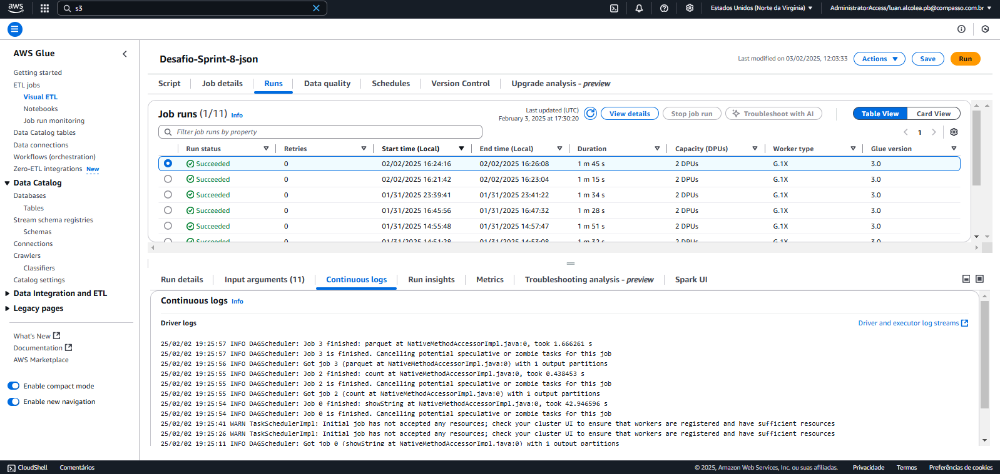
* Log de execução do desafio do script de conversão dos CSVs para parquet
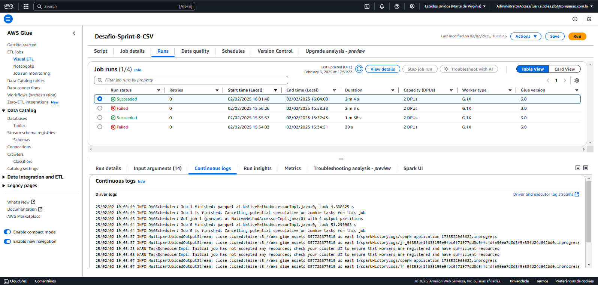
### Arquivos gerados e presentes no AWS S3
* Arquivos parquet gerados a partir do movies.csv
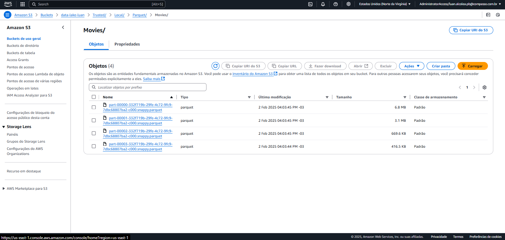
* Arquivos parquet gerados a partir do series.csv
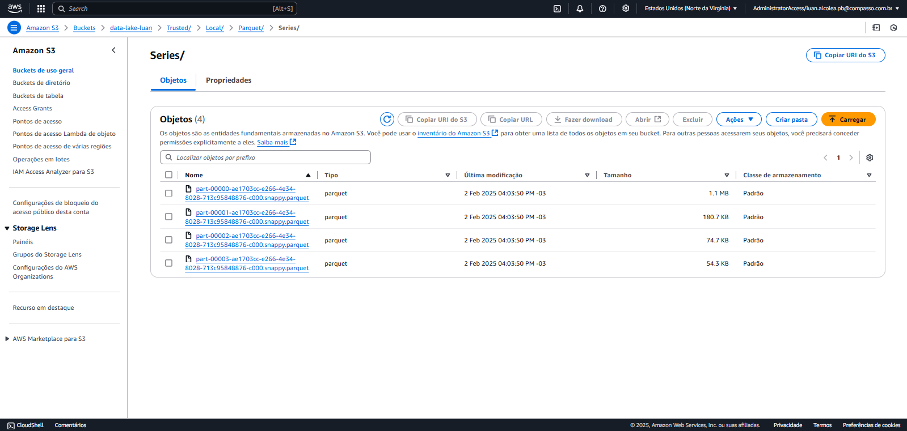
* Arquivos parquet gerados a partir do movies_details.json

### Resultado consulta Crawler
* Resultado da consulta SQL do arquivo parquet convertido a partir do arquivo json
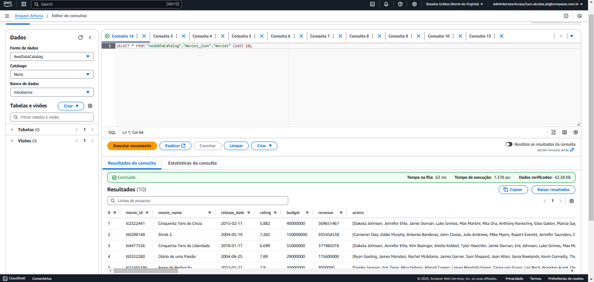
* Resultado da consulta SQL do arquivo parquet convertido a partir do arquivo csv movies
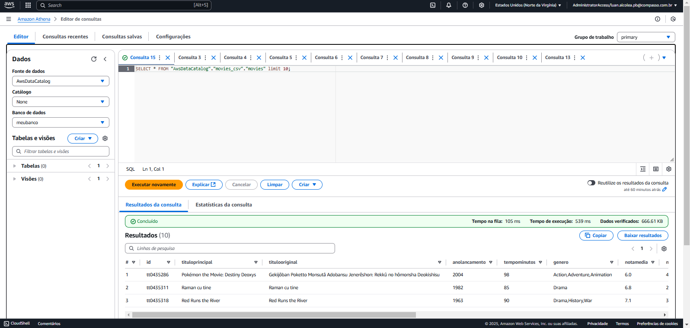
* Resultado da consulta SQL do arquivo parquet convertido a partir do arquivo csv series
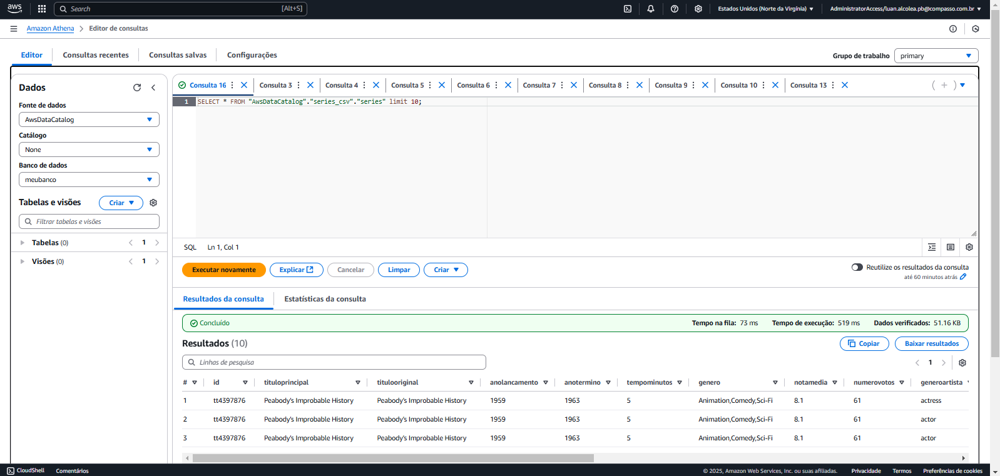
